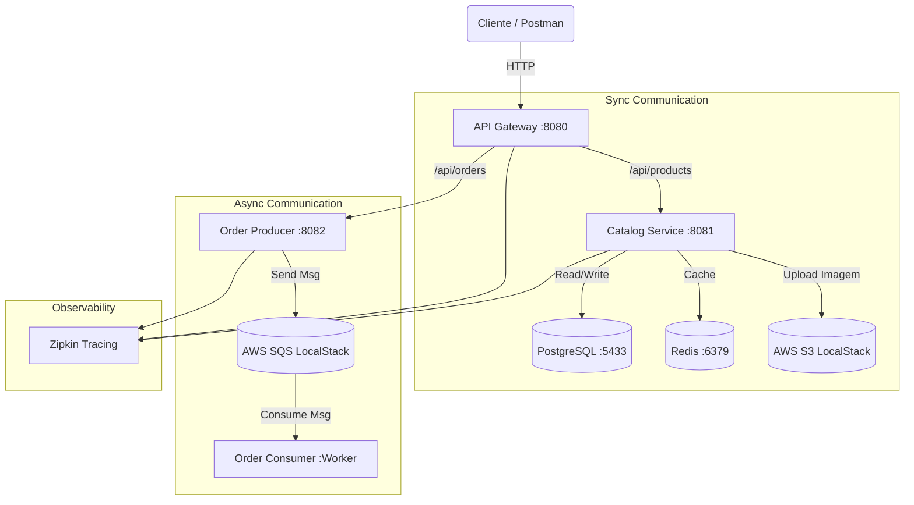

# 🛒 NexusCommerce - Ecossistema de Microsserviços Event-Driven


## 📖 Sobre o Projeto

O **NexusCommerce** é um sistema de e-commerce distribuído, desenvolvido para demonstrar uma arquitetura de microsserviços robusta, escalável e resiliente. O projeto simula um ambiente de produção real utilizando **Spring Boot 3** e **Java 21**, focando em padrões modernos como **Event-Driven Architecture** (EDA), **CQRS** simplificado e **Cache Distribuído**.

O objetivo principal é resolver problemas comuns de alta concorrência:
1.  **Catalog Service:** Alta performance na leitura de produtos usando Cache (Redis) e armazenamento de imagens na nuvem (S3).
2.  **Order Service:** Processamento assíncrono de pedidos para não bloquear o usuário, utilizando filas de mensagens (SQS).

---

## 🏗️ Arquitetura da Solução

O sistema é composto por 3 microsserviços principais orquestrados via Docker Compose.



🛠️ Tecnologias Utilizadas
Linguagem: Java 21 (LTS)

Framework: Spring Boot 3.2.2

API Gateway: Spring Cloud Gateway (Roteamento centralizado)

Banco de Dados: PostgreSQL 15 (Containerizado)

Cache: Redis (Para evitar "cache miss" e aliviar o banco)

Cloud Simulation: LocalStack (Simula AWS S3 e SQS localmente)

Mensageria: Amazon SQS (Simple Queue Service) via Spring Cloud AWS

Armazenamento: Amazon S3 (Simple Storage Service)

Observabilidade: Zipkin (Distributed Tracing)

Ferramentas: Docker Compose, Lombok, IntelliJ IDEA

🚀 Como Rodar o Projeto
Pré-requisitos
Java 21 JDK

Docker & Docker Compose instalados

Maven

Passo 1: Subir a Infraestrutura
Na raiz do projeto, execute o comando para subir os containers (Banco, Redis, LocalStack, Zipkin):

```
docker-compose up -d
```

Passo 2: Configurar a AWS Fake (LocalStack)
Como o LocalStack é volátil, execute estes comandos no terminal para criar o Bucket e a Fila (necessário apenas na primeira vez que subir o Docker):

```
# Criar o Bucket S3 para imagens
docker exec -it 0000-nexuscommerce-localstack-1 awslocal s3 mb s3://nexus-images

# Criar a Fila SQS para pedidos
docker exec -it 0000-nexuscommerce-localstack-1 awslocal sqs create-queue --queue-name nexus-orders
```

Passo 3: Inicializar os MicrosserviçosExecute as aplicações na seguinte ordem (via IDE ou Maven):NexusGatewayApplication (Porta 8080)NexusCatalogApplication (Porta 8081)NexusOrderApplication (Porta 8082)

🧪 Testando a API (Endpoints)Todas as requisições devem ser feitas através do API Gateway (Porta 8080).

1. Criar Produto (Com Upload de Imagem)
URL: POST http://localhost:8080/api/products
Tipo: multipart/form-data

Chave,Tipo,Valor
name,Text,Notebook Gamer Ultra
price,Text,15000.00
image,File,(Selecione um arquivo .jpg/.png)

2. Buscar Produto (Teste de Cache)
URL: GET http://localhost:8080/api/products/{id}

Obs: A primeira chamada consulta o PostgreSQL (lenta). A segunda chamada vem do Redis (instantânea - verifique os logs).

3. Realizar Pedido (Fluxo Assíncrono)
URL: POST http://localhost:8080/api/orders

Body (JSON):

```
{
  "userId": "usuario-teste-01",
  "productId": "cole-o-id-do-produto-aqui",
  "quantity": 1,
  "totalPrice": 15000.00
}

```

Resultado Esperado: A API retornará 202 Accepted imediatamente. No console do nexus-order, você verá o Consumer processando a mensagem em background.

📊 Observabilidade

Acesse o Zipkin para visualizar o rastro distribuído das requisições entre os microsserviços:

URL: http://localhost:9411

📝 Decisões de Arquitetura

Por que SQS? Para desacoplar o recebimento do pedido do seu processamento. Em dias de Black Friday, a API não cai, pois apenas enfileira os pedidos, e os Workers processam na velocidade que o banco suportar (Backpressure).

Por que Redis? O Catálogo de produtos tem muito mais leitura do que escrita. O Cache reduz drasticamente o custo de banco de dados e latência para o usuário final.

Por que LocalStack? Permite desenvolver usando SDKs reais da AWS sem precisar de cartão de crédito ou conta na Amazon, facilitando o ambiente de desenvolvimento (DevEx).

👨‍💻 Autor

Desenvolvido por Thais Scheiner

LinkedIn: https://www.linkedin.com/in/thaisscheiner/